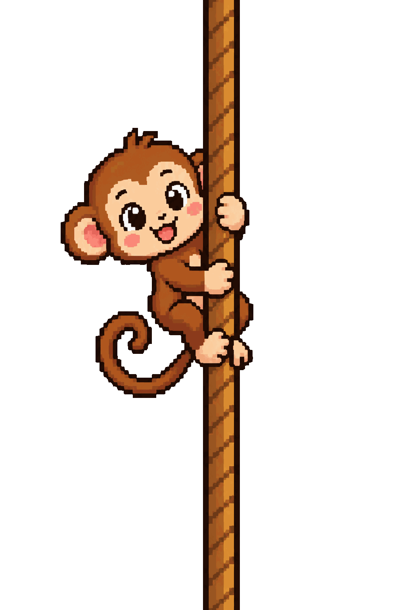

  <strong>Hey, friend!</strong> 
  <strong>Welcome to my GitHub profile</strong>

  

  

  

---

## About Me

Hi! I’m building, learning, and shipping small but meaningful digital experiences.

This profile is a playful pixel-art space that reflects my curiosity, creativity, and a love for clean code and thoughtful design.

The monkey is a visual reminder that exploration and iteration are part of the journey.

  

  

---

## Skills

### Languages
- HTML
- CSS
- JavaScript
- TypeScript
- Python
- SQL

### Tools
- Git / GitHub
- VS Code
- Figma
- Linux
- Docker

### Frameworks
- React
- Node.js
- Express
- Next.js

  

  

---

## Projects

### Featured Project
- Project name: Your project title
- Description: Brief summary of what it does and why it matters
- Tech: Skills and tools used
- Repository: [GitHub repo link](https://github.com)
- Demo: [Live demo link](https://github.com)

### Another Project
- Project name: Another project
- Description: Short explanation
- Tech: List the stack
- Repository: [GitHub repo link](https://github.com)

  

  

---

## Experience

### Role / Position
- Company or team: Your company / team name
- Period: 2024 — Present
- Highlights:
  - Built and improved user-facing products
  - Worked with modern web tools and workflows
  - Collaborated across design, engineering, and product thinking

### Previous Role
- Company or team: Previous team
- Period: 2022 — 2024
- Highlights:
  - Delivered maintainable features
  - Improved developer workflows
  - Focused on quality and usability

  

  

---

## GitHub Stats

  

> Replace YOUR_USERNAME with your actual GitHub username.

  

  

---

## Currently Learning

- Modern frontend patterns
- API design and backend systems
- Better product thinking and problem framing
- Clean, maintainable engineering practices

---

## Contact

- GitHub: [Your GitHub](https://github.com/YOUR_USERNAME)
- LinkedIn: [Your LinkedIn](https://linkedin.com/in/YOUR_USERNAME)
- Email: [you@example.com](mailto:you@example.com)
- Portfolio: [Your website or portfolio](https://example.com)

  

  

---

  <strong>Thanks for visiting my profile.</strong>

  <a href="#top">Back to the top</a>

